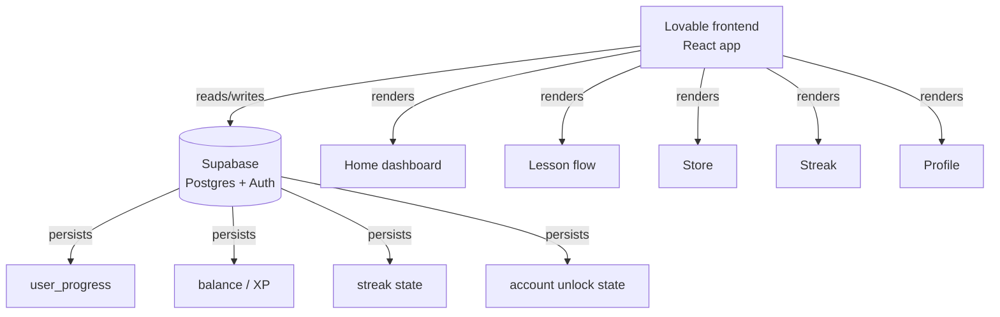

# FinLit — Technical Architecture Canvas

Pairs with [`handoff.md`](handoff.md) for full detail. This is the one-screen version.

## Components

No external APIs are connected. All financial data — balances, accounts, transactions — is app-internal and simulated by design, not sourced from real banking data.

## Data flow, in plain terms

1. User completes a lesson in the **Lesson flow** screen
2. Frontend writes a `user_progress` row to **Supabase**
3. Balance and XP update, read back into the **Home dashboard**
4. If completed-lesson count crosses a threshold, the next locked account flips to unlocked (read from `accounts` state)
5. If this is the first completion on a new calendar day, streak increments in `streak state`; a full skipped day should reset it

## What's real vs. mocked

| Layer | Status |
|---|---|
| Lesson completion → balance/XP update | **Real** — confirmed live via Supabase |
| Sequential lesson locking | **Real** — enforced, can't skip ahead |
| Account unlock thresholds | **Real** — dynamic, tied to lesson count |
| Streak increment (Day 1) | **Real** — confirmed on first session |
| Streak reset on missed day | **Unverified** — logic exists but untested across a real day boundary |
| Push notifications | **Mocked** — in-app toggle only, no delivery mechanism |
| Weekly leaderboard | **Unverified** — UI link exists, not walked through |
| Learning Goal persistence | **Likely broken** — shows "Not set" in Profile despite being set during onboarding |
| Store redemption | **Unverified** — unclear if it deducts real balance or is display-only |
| External financial data / banking APIs | **Not integrated** — out of scope by design |

## #1 technical priority

Verify streak increment/reset logic against real Supabase timestamps across actual multiple days, including timezone handling for what counts as "a new day." This is backend logic, not UI, and it's the one piece the entire product hypothesis depends on that can't be validated in a single sitting.
