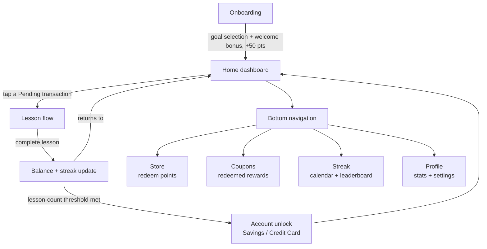

# FinLit — User Flow Canvas

Pairs with the full screen map in [`living-prd.md`](living-prd.md). This is the one-screen version of the primary journey.

## Primary journey

## Step by step

1. **Onboarding** — user selects a learning goal, receives a welcome bonus (+50 pts), lands on Home
2. **Home dashboard** — sees Total Balance, Financial Health Score, an Accounts row (Checking unlocked, Savings/Credit Card locked with progress-gated messages), and an Activity feed listing lessons as transactions (Pending / Locked / Completed)
3. **Lesson flow** — tapping a Pending transaction opens that lesson; lessons must be completed in order, locked ones show "Complete previous lesson to deposit"
4. **Update + return** — on completion, balance and streak update, the feed entry flips to "Completed: [lesson] +[pts]," and the next lesson flips from Locked to Pending
5. **Account unlock** — once the lesson-count threshold for an account is hit, it flips from locked to unlocked and joins the deposit flow
6. **Bottom navigation** (accessible at any point) — Store to redeem points for real-world rewards, Coupons to view redeemed rewards (empty state routes back to Store), Streak to see the day count and calendar, Profile for stats and settings

## What's confirmed vs. still untested

- **Confirmed** — steps 1 through 5 walked through and verified working on a first session
- **Untested** — whether a user returning on Day 2+ experiences the flow correctly (streak increment/reset specifically)
